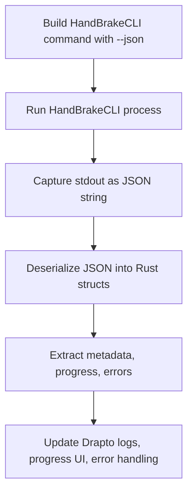

# Drapto: HandBrakeCLI JSON Integration Plan

---

## Overview

Drapto currently invokes HandBrakeCLI and logs its plain text output.  
HandBrakeCLI supports a `--json` mode, which outputs detailed, structured metadata, scan results, job configuration, progress updates, and final status in JSON format.

This plan outlines how Drapto could leverage this JSON output to improve metadata extraction, progress tracking, error handling, and automation.

---

## Motivation

- **Structured Data:** JSON output is easier and more reliable to parse than plain text logs.
- **Rich Metadata:** Access detailed info about input streams, scan results, filters, and encoding settings.
- **Progress Tracking:** Parse real-time progress updates for better UI/CLI feedback.
- **Robust Error Handling:** Detect errors and warnings programmatically.
- **Automation:** Enable smarter workflows, e.g., dynamic parameter tuning based on scan results.

---

## Benefits

- **More accurate input analysis** (resolution, crop, color, audio/subtitles)
- **Improved progress reporting** (ETA, percent complete, fps)
- **Clearer error messages** and job status
- **Potential for automated parameter adjustment** based on scan metadata
- **Foundation for future features** like job templates or advanced UI

---

## Proposed Architecture

### 1. Enable JSON output

- Add `--json` to HandBrakeCLI command invocation.
- Optionally, make this configurable.

### 2. Capture JSON output

- Buffer stdout when `--json` is enabled.
- After process exit, parse the buffered output as JSON.

### 3. Define Rust data structures

Use `serde` to deserialize JSON into strongly typed Rust structs.

Example:

```rust
#[derive(Debug, Deserialize)]
pub struct HandBrakeJson {
    pub Version: VersionInfo,
    pub Progress: Option<ProgressInfo>,
    pub State: Option<String>,
    pub Source: Option<SourceInfo>,
    pub Video: Option<VideoInfo>,
    pub Audio: Option<AudioInfo>,
    // ... other fields
}

#[derive(Debug, Deserialize)]
pub struct VersionInfo {
    pub Arch: String,
    pub Name: String,
    pub VersionString: String,
    // ...
}

#[derive(Debug, Deserialize)]
pub struct ProgressInfo {
    pub State: String,
    pub Working: Option<WorkingProgress>,
    pub Scanning: Option<ScanningProgress>,
    // ...
}
```

### 4. Use parsed data

- **Input analysis:** Extract streams, crop, color info
- **Progress:** Display ETA, percent, fps
- **Errors:** Detect and report failures
- **Automation:** Adjust parameters dynamically (future)

---

## Implementation Steps

1. Modify command builder to add `--json`
2. Buffer stdout during HandBrakeCLI execution
3. Parse JSON output with `serde_json`
4. Define Rust structs matching JSON schema
5. Integrate parsed data into Drapto's workflow:
   - Metadata extraction
   - Progress updates
   - Error handling
6. Update CLI/UI to display richer info
7. Add tests with sample JSON outputs

---

## Mermaid Diagram



---

## Status

This is a **design plan only**.  
Implementation is deferred until further notice.