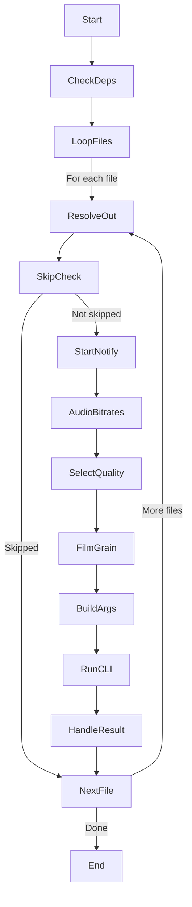
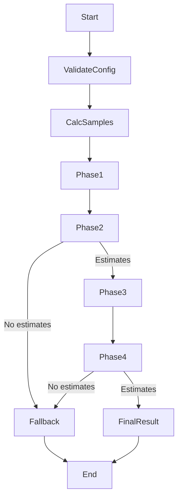

# Drapto Refactoring Plan: Large Function Decomposition

---
## Problem Statement

Some functions are quite large (e.g., process_videos, determine_optimal_grain). While not overengineered, they might benefit from internal refactoring for readability and maintainability.

Refactor large functions (process_videos, determine_optimal_grain) into smaller private helpers to improve readability, not to add abstraction layers.

## Goals
- Improve readability and maintainability
- Avoid overengineering: no new abstractions, traits, or generics
- Extract logical steps into private helper functions
- Keep orchestration logic clear and minimal

---

## 1. `process_videos`

### Proposed Helper Functions

| Helper Function Name | Responsibility | Input(s) | Output(s) |
|----------------------|----------------|----------|-----------|
| `check_dependencies` | Check for HandBrakeCLI and ffprobe, log status | `log_callback` | `(handbrake_cmd_parts, ffprobe_cmd_parts)` |
| `resolve_output_path` | Determine output path, handle override | `config, input_path, target_filename_override, files_to_process_len` | `PathBuf` |
| `skip_if_output_exists` | Check if output exists, send skip notification if so | `output_path, filename, config, hostname, log_callback` | `bool` (true if skipped) |
| `send_start_notification` | Send ntfy start notification | `config, hostname, filename, log_callback` | - |
| `get_audio_bitrates` | Detect audio channels, calculate bitrates | `input_path, filename, log_callback` | `Vec<u32>` |
| `select_quality` | Determine video width, select CRF quality | `input_path, config, log_callback` | `(u32, u32)` (width, quality) |
| `determine_film_grain_value` | Run or skip film grain optimization | `input_path, config, log_callback, handbrake_cmd_parts` | `u8` |
| `build_handbrake_args` | Build CLI args for HandBrakeCLI | `config, audio_bitrates, quality, film_grain_value, input_path, output_path, log_callback` | `VecDeque<String>` |
| `run_handbrake_cli` | Spawn process, stream output, return status and stderr | `handbrake_executable, args, log_callback` | `(bool, String)` (success, stderr) |
| `handle_encode_result` | Log result, send success/failure notification, update results vec | `success, stderr, input_path, output_path, filename, start_time, config, hostname, log_callback, results` | - |

### High-Level Flow

---

## 2. `determine_optimal_grain`

### Proposed Helper Functions

| Helper Function Name | Responsibility | Input(s) | Output(s) |
|----------------------|----------------|----------|-----------|
| `validate_and_load_config` | Load config, apply defaults, validate | `config, log_callback` | Config params struct |
| `calculate_sample_points` | Determine sample start times | `duration_fetcher, input_path, config_params, log_callback` | `Vec<f64>` |
| `phase1_initial_testing` | Run initial grain tests on all samples | `sample_points, initial_grain_values, sample_tester, log_callback` | `AllResults` |
| `phase2_estimate_per_sample` | Calculate initial per-sample estimates | `phase1_results, knee_threshold, log_callback` | `Vec<u8>` |
| `phase3_refinement` | Generate refined grain values, run tests | `initial_estimates, sample_points, sample_tester, config_params, handbrake_cmd_parts, log_callback` | `AllResults` |
| `phase4_final_selection` | Combine results, calculate final estimates | `phase1_results, phase3_results, knee_threshold, log_callback` | `Vec<u8>` |
| `calculate_final_result` | Median and cap final estimates | `final_estimates, max_value, log_callback` | `u8` |

### High-Level Flow

---

## Summary

- Extracting these helpers will **reduce cognitive load** when reading the orchestration functions.
- Each helper encapsulates a **single responsibility**.
- This approach **avoids overengineering** by not introducing new abstractions or complexity.
- The orchestration functions will become **high-level workflows**, improving maintainability.

---

## Next Steps

- Switch to code mode
- Incrementally extract these helpers
- Test thoroughly after each refactor step
- Keep the scope minimal and focused