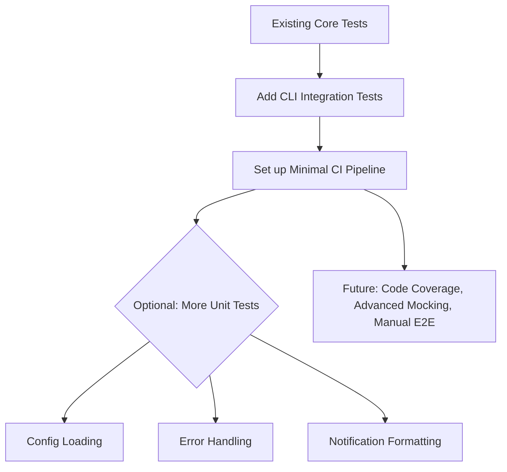

# Drapto Testing Strategy Implementation Plan

## Overview
Operationalize the existing testing strategy by filling identified gaps:
- Add CLI integration tests focusing on argument parsing and HandBrakeCLI command generation.
- Set up a minimal CI pipeline.
- Optionally, add targeted unit tests for config, error handling, and notifications if not already covered.

---

## Step 1: CLI Integration Tests

**Goal:** Verify that `drapto-cli` correctly parses arguments, interacts with `drapto-core`, and generates the expected HandBrakeCLI commands.

**Approach:**
- Create new integration tests in `drapto-cli/tests/`, e.g., `cli_integration.rs`.
- Use `assert_cmd` or similar crates to invoke the CLI binary with various arguments.
- Mock or stub the HandBrakeCLI invocation:
  - Use a feature flag or environment variable to replace actual command execution with a dummy function during tests.
  - Verify the generated command string matches expectations.
- Cover key commands like `encode`, including edge cases and error scenarios.

**Example Test Flow:**
```rust
// Pseudocode
invoke `drapto encode --input fake.mkv --output fake.mp4 --preset Fast`
assert that the mocked HandBrakeCLI command is:
"HandBrakeCLI -i fake.mkv -o fake.mp4 --preset Fast"
```

---

## Step 2: Minimal Continuous Integration (CI)

**Goal:** Automatically run tests on every commit or pull request.

**Approach:**
- Create `.github/workflows/ci.yml` with a simple GitHub Actions workflow:
  - Trigger on push and pull_request.
  - Use the latest stable Rust.
  - Steps:
    - Checkout code
    - Install Rust toolchain
    - Run `cargo build --all`
    - Run `cargo test --all`
- This ensures all tests pass before merging changes.

**Sample Workflow:**
```yaml
name: CI

on: [push, pull_request]

jobs:
  build-and-test:
    runs-on: ubuntu-latest
    steps:
      - uses: actions/checkout@v4
      - uses: actions-rs/toolchain@v1
        with:
          toolchain: stable
          override: true
      - run: cargo build --all
      - run: cargo test --all
```

---

## Step 3: Optional Targeted Unit Tests

**If needed,** add or expand unit tests for:
- **Config loading:** Valid and invalid config scenarios.
- **Error types:** Custom error behavior.
- **Notification formatting:** Without sending actual notifications.

---

## Step 4: Future Enhancements

- **Code coverage:** Use `cargo-tarpaulin` locally or in CI.
- **Advanced mocking:** Introduce `mockall` if interactions become complex.
- **Manual end-to-end tests:** Occasionally run real HandBrakeCLI commands outside CI.

---

## Mermaid Diagram: Testing Strategy Implementation



---

## Summary
This plan aligns with the pragmatic, minimal approach outlined in `docs/testing_strategy.md`, focusing on high-value tests and automation without overengineering.